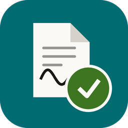

# PDF Sign Assistant

> Caja de herramientas de escritorio en Python + PyQt6 para trabajar con PDFs: firmarlos a mano sin perder el original y armar documentos nuevos desde el escáner — diseñada para usuarios no técnicos, con una interfaz clara, guiada y con modo claro/oscuro.

<p align="center">
  
</p>

---

## ⬇️ Descargar

**[Descargar la última versión](https://github.com/CrazyK-oss/pdf-sign-assistant/releases/latest)** · Windows 10 u 11

| Archivo | Para quién |
|---------|-----------|
| `PDFSignAssistant-X.Y.Z-Setup.exe` | **La mayoría.** No pide permisos de administrador y crea el acceso directo. |
| `PDFSignAssistant-X.Y.Z-portable.zip` | Sin instalar nada (por ejemplo, desde un pendrive). Descomprimir y ejecutar. |

### La primera vez, Windows va a advertirte

La aplicación **no está firmada digitalmente**, así que SmartScreen muestra
*"Windows protegió su PC"*. Es lo esperable en software sin certificado, no una
señal de que el archivo esté mal. Para continuar:

**Más información → Ejecutar de todas formas**

Si querés verificar la descarga, cada Release publica un `SHA256SUMS.txt`.

### Actualizaciones

Una vez instalada, **no hace falta volver a descargar nada**: la app consulta
una vez por día si hay versión nueva y te avisa. Si aceptás, descarga el
instalador, verifica su integridad y se actualiza sola — se cierra, se
actualiza y se vuelve a abrir.

Se puede desactivar en **⚙ Ajustes → Actualizaciones**, donde también está el
botón **Buscar ahora**.

> Nunca se instala nada sin tu confirmación: la comprobación es automática, la
> instalación no.

### Dónde quedan tus archivos

| Qué | Dónde |
|-----|-------|
| Documentos firmados | `Documentos\PDF Sign Assistant` |
| Configuración y logs | `%LOCALAPPDATA%\PDF Sign Assistant` |

Al desinstalar, **tus documentos no se borran**. Si venías de una versión
anterior que guardaba todo junto al ejecutable, la app mueve esos datos a las
carpetas nuevas la primera vez que arranca.

---

## Descripción

**PDF Sign Assistant** es un menú de herramientas para trabajar con PDFs sin
salir de tu máquina. Hoy trae dos:

| Herramienta | Para qué sirve |
|-------------|----------------|
| **Firmar un PDF** | Imprimí las páginas que hay que firmar, firmalas a mano, escaneálas y la app las reemplaza dentro del documento original. El PDF que sale es el mismo de siempre, con tu firma real encima |
| **Escanear a PDF** | Armá un documento nuevo página por página desde el escáner. Reordenalas, giralas, descartá la que salió mal y guardá el PDF terminado |

Todo pasa en la computadora del usuario: no hay servidor, ni cuenta, ni
subida de archivos a ningún lado.

Agregar una herramienta más es sumar una entrada a `CATALOGO`
(`modules/navegacion.py`) y registrar su widget: ni la barra lateral ni la
pantalla de inicio hay que tocarlas.

---

## Funcionalidades

- 📧 **El PDF entra en un correo** — las páginas escaneadas se remuestrean y se comprimen al guardar: una hoja firmada pasa de 3,4 MB a 0,26 MB, y podés elegir la calidad. Si aun así se pasa del límite de adjunto, la app lo avisa y ofrece rehacerlo más liviano
- 🧰 **Menú de herramientas** — barra lateral permanente y pantalla de inicio con una tarjeta por herramienta; se colapsa a una tira de iconos cuando la ventana se angosta
- 🖨️ **Escanear a PDF** — armá un documento nuevo hoja por hoja: cada página aparece con su miniatura y se puede subir, bajar, girar o descartar antes de guardar
- 🎨 **Iconografía vectorial propia** — 49 iconos dibujados en SVG dentro del código, que se colorean con el tema. Ya no dependen de que la fuente del sistema tenga el emoji (`👁` salía como una raya y `🌙` como un punto, según la máquina)
- 📄 **Vista previa en cuadrícula** — visualizá todas las páginas del PDF antes de elegir cuáles firmar
- 🗂️ **Firma de varias páginas por sesión** — elegí 1, 3 o 20 páginas: se imprimen en un solo trabajo, se escanean en una cola y se reemplazan todas de una vez
- 🔍 **Vista previa grande** — doble clic en una página para verla completa y decidir con seguridad
- 🔄 **Rotación por página** — corregí escaneos al revés sin salir de la app ni tocar el archivo original
- 🖨️ **Impresión directa** — envía las páginas seleccionadas a la impresora en un único trabajo
- 🖼️ **Integración con escáner** — digitalizá cada hoja o cargá varias imágenes de una y se reparten solas entre las páginas pendientes
- 📌 **Reemplazo de páginas** — incrusta cada hoja firmada en su página correspondiente del PDF original
- 💾 **Lista de trabajos guardados** — historial de documentos procesados con fecha y hora; permite re-editar
- ✉️ **Envío por correo** — abre tu cliente de correo con destinatario/asunto listos y una carpeta temporal con el PDF adjuntable
- ⚙️ **Panel de ajustes** — configurá el correo emisor (servidor, puerto, credenciales) desde la UI, sin tocar archivos de configuración
- 🌙 **Modo claro y oscuro** — alternás con un clic; se aplica a toda la interfaz en tiempo real y queda recordado entre sesiones
- 📐 **Interfaz adaptable** — las pantallas reacomodan columnas y apilan paneles cuando la ventana es angosta; todo entra desde 460 px de ancho
- ⌨️ **Atajos de teclado** — flujo completo sin mouse (ver tabla más abajo)
- 🔎 **Búsqueda en guardados** — filtrá el historial por nombre a medida que escribís
- 🧾 **Registro en el propio PDF** — el documento guarda qué páginas se firmaron, así al reabrirlo o enviarlo el resumen es exacto
- 🔔 **Actualizador interno** — la app avisa cuando hay versión nueva y se actualiza sola, sin pasar por GitHub ni reinstalar a mano
- 📋 **Log en archivo** — `logs/pdf_sign_assistant.log` con rotación, para diagnosticar problemas en la PC del usuario
- 🔒 **Cancelación segura** — cancelá en cualquier etapa sin corromper el archivo original

---

## Flujo de trabajo

### Firmar un PDF

```
Abrir PDF  →  Elegir páginas  →  Imprimir  →  Escanear cada hoja firmada  →  Guardar PDF  →  Enviar
```

Se pueden firmar **varias páginas en una misma sesión**. La selección, las
imágenes de cada página y sus rotaciones viven en un único objeto
(`modules/trabajo.py`), así que volver atrás en cualquier paso conserva lo
que ya habías hecho.

| Paso | Módulo | Descripción |
|------|--------|-------------|
| 1 | `main.py` | Abrir un PDF y cargarlo en la sesión de trabajo |
| 2 | `fase1_preview.py` | Cuadrícula de miniaturas; selección múltiple y vista previa grande |
| 3 | `fase2_print.py` | Envío de todas las páginas elegidas en un solo trabajo de impresión |
| 4 | `fase3_scan.py` | Cola de escaneo: una imagen por página, con rotación y avisos de orientación |
| 5 | `fase_guardar.py` | Reemplazo de todas las páginas, metadatos y guardado del PDF firmado |
| 6 | `fase4_email.py` | Flujo de envío: carpeta temporal + apertura del cliente de correo |

### Escanear a PDF

```
Escanear hoja  →  (repetir)  →  Reordenar / girar / descartar  →  Guardar PDF
```

Es un flujo mucho más corto porque no hay documento original que respetar:
se van apilando páginas hasta que el documento está completo.

| Paso | Módulo | Descripción |
|------|--------|-------------|
| 1 | `escaner_qt.py` | Digitaliza una hoja a 300 DPI en un hilo aparte, sin congelar la ventana |
| 2 | `documento_escaneado.py` | Modelo de la lista de páginas: orden, rotación y altas/bajas (lógica pura, sin Qt) |
| 3 | `herramienta_escaneo.py` | La pantalla: miniaturas, vista previa y acciones por página |
| 4 | `imagen_pdf.py` | Cada imagen → PDF de una página; después se unen en el documento final |

También se pueden **arrastrar imágenes** a la ventana o importarlas desde el
disco, por si el escaneo ya estaba hecho.

---

## Estructura del proyecto

```
pdf-sign-assistant/
├── main.py                  # Punto de entrada · ventana principal · orquestación del flujo
├── LICENSE                  # MIT
├── assets/icon.ico          # Icono de la app y del instalador
├── installer/               # Script de Inno Setup (genera el Setup.exe)
├── tests/                   # Tests de lógica pura (corren en CI, sin Qt)
├── .github/workflows/       # CI en cada push · Release al crear un tag
├── config.json              # Configuración local (NO versionada — la escribe Ajustes)
├── config.example.json      # Plantilla de configuración
├── config.example.env       # Plantilla de variables de entorno
├── requirements.txt         # Dependencias de Python
├── pdf_sign_assistant.spec  # Configuración de PyInstaller para generar el .exe
│                            # (en ejecución, los datos NO se guardan acá:
│                            #  ver la tabla de "Dónde quedan tus archivos")
└── modules/
    ├── __init__.py
    │
    │   # ── Base visual ───────────────────────────────────────────────
    ├── theme.py             # Sistema de diseño: paletas, tokens (espaciado/radios/tipografía), stylesheet
    ├── iconos.py            # Catálogo de iconos SVG dibujados en código, coloreados por el tema
    ├── ui.py                # Kit de componentes (botones con icono, chips, avisos, tarjetas, contenedores responsive)
    ├── navegacion.py        # Catálogo de herramientas + barra lateral + pantalla de inicio
    │
    │   # ── Infraestructura ───────────────────────────────────────────
    ├── setup.py             # Rutas compatibles con PyInstaller + carga/guardado de config
    ├── dispositivos.py      # Capa única de impresoras y escáneres: validación, COM y errores traducidos
    ├── escaner_qt.py        # El hilo que abre el diálogo WIA sin congelar la ventana (lo comparten las dos herramientas)
    ├── imagen_pdf.py        # Imagen → PDF de una página (reportlab / img2pdf / Pillow), sin Qt
    ├── errores.py           # Manejador global de excepciones: log + aviso al usuario
    ├── version.py           # Única fuente de verdad de la versión (app, instalador y CI la leen de acá)
    ├── actualizaciones.py   # Lógica del actualizador: versiones, descarga y verificación SHA-256 (sin Qt)
    ├── actualizador.py      # Capa Qt del actualizador: workers y diálogo
    ├── settings.py          # Diálogo de ajustes de correo emisor (SMTP, credenciales)
    │
    │   # ── Herramienta: firmar un PDF ────────────────────────────────
    ├── trabajo.py           # Modelo del trabajo en curso: páginas, imágenes y rotaciones (lógica pura, sin Qt)
    ├── fase1_preview.py     # Cuadrícula de miniaturas y selección de página
    ├── fase2_print.py       # Integración con la impresora del sistema
    ├── fase3_scan.py        # Cola de escaneo: una imagen por página, con rotación
    ├── fase_guardar.py      # Lógica de reemplazo de página y guardado del PDF
    ├── fase4_email.py       # Flujo de envío: carpeta temporal + cliente de correo
    │
    │   # ── Herramienta: escanear a PDF ───────────────────────────────
    ├── documento_escaneado.py  # Modelo del documento que se arma: orden y rotación de páginas (sin Qt)
    └── herramienta_escaneo.py  # La pantalla: miniaturas, vista previa, reordenar y guardar
```

La separación **modelo sin Qt / pantalla** no es adorno: es lo que permite
que los tests cubran el reordenamiento de páginas, el parseo de rangos y el
saneamiento de nombres de archivo sin abrir una ventana ni tener un escáner
conectado.

---

## Flujo de envío por correo

El envío **no usa SMTP directo** — en cambio abre tu cliente de correo habitual (Outlook, Gmail, Thunderbird, etc.) con los datos ya cargados, y te muestra el PDF listo para arrastrar al adjunto.

1. Seleccioná un documento firmado en la lista y pulsá **✉️ Enviar por correo**
2. Completá el destinatario y el asunto en el diálogo
3. Pulsá **✉️ Abrir correo y carpeta** — se abren simultáneamente:
   - El **Explorador de archivos** mostrando `pdfs_firmados/_envio_temp/` con solo ese PDF
   - Tu **cliente de correo** (o navegador) con destinatario y asunto ya listos
4. Arrastrá el PDF al correo y enviá normalmente

La carpeta `_envio_temp/` se borra **al cerrar la app** y también **al iniciarla**, por si la sesión anterior terminó de forma abrupta.

---

## Atajos de teclado

| Atajo | Acción |
|-------|--------|
| `Ctrl+0` | Ir al menú de herramientas |
| `Ctrl+1` | Abrir *Firmar un PDF* |
| `Ctrl+2` | Abrir *Escanear a PDF* |
| `Ctrl+O` | Abrir un PDF |
| `Ctrl+E` | Enviar por correo el documento seleccionado |
| `Ctrl+F` | Buscar en la lista de guardados |
| `Ctrl+D` | Alternar tema claro / oscuro |
| `F5` | Recargar la lista de documentos |
| `Enter` | Editar el documento seleccionado |

**En *Escanear a PDF*:** `Ctrl+N` escanea la hoja siguiente, `Ctrl+↑` / `Ctrl+↓`
mueven la página seleccionada, `Ctrl+S` guarda el documento y `Esc` vuelve al menú.

**Al elegir páginas:** `←` `→` `↑` `↓` recorren la cuadrícula, `Inicio`/`Fin`
saltan a la primera o última página, `Espacio` (o doble clic) abre la vista
previa grande, `Ctrl+A` selecciona todas, `Ctrl+F` va al campo de rangos,
`Enter` confirma y `Esc` sale.

**Selección múltiple:** clic alterna una página, `Shift+clic` marca un rango
desde la última tocada, y el campo *Páginas* acepta expresiones como
`1, 3, 5-8`.

**En la vista previa grande:** `←` `→` cambian de página, `Espacio` marca o
desmarca, `Esc` cierra.

**En escaneo y guardado:** `Esc` vuelve atrás y `Enter` confirma.

---

## Requisitos previos

- **Python** 3.10 o superior
- **Windows** para imprimir y escanear: la impresión usa GDI (`StretchDIBits`) y el escaneo usa WIA, ambos vía `pywin32`.
  El resto de la app (abrir, previsualizar, reemplazar página, guardar, enviar) funciona en cualquier sistema.
- **Escáner compatible** *(opcional — también se pueden cargar imágenes desde disco o arrastrarlas a la ventana)*:
  - Windows: WIA (integrado, compatible con HP LaserJet MFP)

> No hace falta Poppler ni `pdf2image`: el render lo hace **PyMuPDF** directamente.

---

## Instalación desde el código (desarrollo)

> Si sólo querés **usar** la app, no necesitás nada de esto: bajá el instalador
> desde [Releases](https://github.com/CrazyK-oss/pdf-sign-assistant/releases/latest).

```bash
# 1. Clonar el repositorio
git clone https://github.com/CrazyK-oss/pdf-sign-assistant.git
cd pdf-sign-assistant

# 2. Crear entorno virtual
python -m venv venv

# 3. Activarlo
venv\Scripts\activate        # Windows
source venv/bin/activate     # Linux / macOS

# 4. Instalar dependencias
pip install -r requirements.txt
```

---

## Configuración

### Opción A — Panel de Ajustes (recomendado)

Abrí la app y hacé clic en el botón **⚙** del header. Desde ahí podés configurar:
- Proveedor SMTP (Gmail, Outlook, Yahoo, Zoho o Personalizado)
- Correo emisor y contraseña de aplicación
- Servidor y puerto SMTP

Los cambios se guardan en `config.json` (escritura atómica: se escribe un temporal y recién ahí se reemplaza el archivo).

### Opción B — Copiar la plantilla

```bash
cp config.example.json config.json     # Windows: copy config.example.json config.json
```

```json
{
    "email_user": "tucorreo@dominio.com",
    "email_password": "",
    "smtp_server": "smtp.gmail.com",
    "smtp_port": 587,
    "tema": "light"
}
```

Si `config.json` no existe, la app arranca igual con los valores por defecto.

### Sobre las credenciales

`config.json` **no se versiona** (está en `.gitignore`) porque el diálogo de Ajustes escribe ahí lo que cargues.

> ⚠️ La contraseña se guarda **en texto plano** y hoy **ningún flujo la usa**: el envío abre tu cliente
> de correo por `mailto:` en vez de hablar SMTP. Podés dejar el campo vacío sin perder ninguna función.
> Si más adelante se implementa el envío SMTP directo, conviene mover el secreto a `.env`
> (ya soportado vía `python-dotenv`) o al almacén de credenciales del sistema.

---

## Ejecutar la app

```bash
python main.py
```

La app crea automáticamente las carpetas `pdfs_trabajo/` y `pdfs_firmados/` al iniciarse.

---

## Generar ejecutable (.exe)

```bash
# Con el venv activo:
pip install pyinstaller
pyinstaller pdf_sign_assistant.spec
```

El ejecutable se genera en `dist/PDF Sign Assistant/`. Distribuí **siempre la carpeta completa**, nunca solo el `.exe`.

> **Nota:** Si PyInstaller no encuentra `python3XX.dll`, el `.spec` incluye lógica para localizarla automáticamente usando `sys.base_exec_prefix` (funciona correctamente dentro de entornos virtuales).

---

## Publicar una versión

El build no se hace a mano: lo hace GitHub Actions en un Windows limpio, así no
hay "en mi máquina andaba".

```bash
# 1. Subir el número de versión (única fuente de verdad)
#    modules/version.py  →  __version__ = "0.8.0"

# 2. Commitear y etiquetar
git commit -am "release: v0.8.0"
git tag v0.8.0
git push origin main --tags
```

El workflow `.github/workflows/release.yml` corre los tests, compila con
PyInstaller, arma el instalador con Inno Setup, genera el ZIP portable y los
checksums, y publica todo en un Release nuevo. Si el tag no coincide con
`modules/version.py`, **falla a propósito** antes de publicar nada.

Para probar el build sin publicar: pestaña **Actions → Release → Run workflow**.
Los artefactos quedan disponibles 14 días.

### Sobre la firma de código

Los binarios van **sin firmar**, así que Windows SmartScreen muestra una
advertencia la primera vez. Es la principal fricción para un usuario no
técnico. Para eliminarla hace falta un certificado de firma de código:

| Tipo | Costo aprox. | Efecto |
|------|-------------|--------|
| Sin firma | — | SmartScreen advierte siempre |
| OV | ~150-400 USD/año | Advierte hasta acumular reputación (semanas) |
| EV | ~300-600 USD/año | Sin advertencia desde el día uno |

Cuando haya certificado, se agrega un paso de `signtool` en el workflow entre
el build y el instalador, con el `.pfx` y su contraseña en GitHub Secrets.

> **Detalle relevante:** el `.spec` usa `upx=False` a propósito. UPX achica el
> binario pero dispara falsos positivos de antivirus en ejecutables de
> PyInstaller, que es exactamente lo que no querés al distribuir.

---

## Dependencias

| Paquete | Propósito |
|---------|-----------|
| `PyQt6` | Framework de UI de escritorio |
| `pymupdf` | Parseo y renderizado de PDFs |
| `Pillow` | Procesamiento y conversión de imágenes |
| `img2pdf` | Conversión de imagen a PDF |
| `pypdf` | Manipulación de PDFs (reemplazo de páginas) |
| `reportlab` | Motor principal de conversión imagen → PDF |
| `pywin32` | Impresión GDI y escáner WIA en Windows (`sys_platform == "win32"`) |
| `python-dotenv` | Carga de archivos `.env` |

---

## Changelog

Los cambios de cada versión están en **[CHANGELOG.md](CHANGELOG.md)**.

Ese archivo es la fuente de verdad: el workflow de Release toma de ahí las
notas de cada publicación, y el actualizador interno muestra esa misma
sección al avisar que hay una versión nueva.

## Roadmap

- [x] ~~**Firma de múltiples páginas** — seleccionar y procesar varias páginas en una sola sesión~~ *(v0.7)*
- [x] ~~**Menú de herramientas** — una ventana que aloje varias herramientas de PDF~~ *(v0.11)*
- [x] ~~**Escanear a PDF** — armar un documento nuevo desde el escáner~~ *(v0.11)*
- [ ] **Unir y dividir PDFs** — combinar documentos o extraer un rango de páginas
- [ ] **Procesamiento por lotes** — poner en cola varios PDFs y firmarlos secuencialmente
- [ ] **Firma digital criptográfica** — incrustar firmas digitales sin necesidad de imprimir
- [ ] **Exportar como ZIP** — empaquetar el PDF firmado junto con sus imágenes escaneadas
- [ ] **Soporte macOS** — integración nativa con impresoras y escáneres vía CUPS / ImageCapture
- [x] ~~**Persistencia del tema** — recordar la preferencia de tema claro/oscuro entre sesiones~~ *(v0.6)*

---

## Sobre los drivers

**No se unifican drivers, y no se puede.** Los distribuye el fabricante y los
instala Windows: una aplicación no puede empaquetarlos ni reemplazarlos. Lo que
sí existe es la capa de unificación del propio sistema, y es la que usa esta
app:

| Dispositivo | API | Por qué |
|-------------|-----|---------|
| Impresora | **GDI** (`StretchDIBits` sobre el printer DC) | Escribe los píxeles directo, sin que ICM ni GDI+ toquen el color |
| Escáner | **WIA** | Estándar de Windows; el fabricante provee el driver |

Lo que sí se unifica es **nuestro lado**: todo el acceso a dispositivos pasa por
`modules/dispositivos.py`. Ningún otro módulo importa `win32*`. Eso da un único
lugar donde validar, traducir errores y, sobre todo, **testear** — el hardware no
existe en CI, así que la lógica tiene que ser aislable.

### Los drivers mienten

La capa asume que un driver puede devolver cualquier cosa, y lo corrige:

| Lo que informa el driver | Qué pasaba antes | Qué hace ahora |
|--------------------------|------------------|----------------|
| `0` DPI | `ZeroDivisionError` — la impresión reventaba | Usa 300 DPI y lo anota en el log |
| `0` de área imprimible | Escala 0 → **hoja impresa en blanco, sin aviso** | Asume A4 y lo anota |
| Valores absurdos (10⁶ DPI) | Bitmap gigante → sin memoria | Se acota a un rango razonable |
| Rechaza un bitmap grande | Se abortaba todo el trabajo | Reintenta a 200 y 150 DPI |

### ¿Y TWAIN?

Sería el respaldo para escáneres viejos que no exponen WIA. **No está implementado
a propósito:** el DSM de TWAIN arrastra un problema de 32 vs 64 bits que cuesta más
de lo que resuelve. La puerta queda abierta —`dispositivos.py` es el único lugar a
tocar— para cuando aparezca un escáner concreto que lo necesite.

---

## Notas técnicas

- Solo puede haber **un PDF en proceso** a la vez; el botón "Abrir PDF" se deshabilita hasta que la sesión actual se cierre o complete.
- Las copias de trabajo se guardan en `pdfs_trabajo/` y se limpian automáticamente al guardar o cancelar.
- Los documentos firmados se persisten en `pdfs_firmados/` y aparecen en la ventana principal con su fecha de modificación.
- La carpeta `pdfs_firmados/_envio_temp/` es estrictamente temporal — no guardes archivos importantes ahí.
- Hacer doble clic en un documento guardado lo reabre para re-editar sin modificar el original.
- Todos los errores se muestran como diálogos amigables; los tracebacks detallados se imprimen en consola para depuración.
- La conversión imagen → PDF intenta tres motores en orden: **reportlab** → **img2pdf** (en subproceso aislado, porque puede crashear a nivel de extensión C) → **Pillow**.
- **COM se inicializa en el hilo del escáner** (`CoInitialize`/`CoUninitialize` en STA). pywin32 no lo hace solo en hilos nuevos: sin eso, toda llamada a WIA falla con *"CoInitialize has not been called"*, y el usuario veía un error genérico que lo mandaba a revisar cables.
- Los `com_error` de WIA se traducen a mensajes con causa y sugerencia. Un `0x80210006` crudo no le dice nada a nadie; "El escáner está ocupado" sí.
- Si hay **más de un escáner** instalado, se muestra el selector de WIA. Antes se usaba siempre el predeterminado, sin decir cuál era.
- El actualizador **verifica el SHA-256** del instalador descargado contra el `SHA256SUMS.txt` del Release antes de ejecutarlo. Eso protege la integridad de la descarga (corrupción, intercepción), pero no cubre un repositorio comprometido: para eso hace falta firma de código.
- La actualización silenciosa es posible **porque el instalador no pide permisos de administrador**. Si instalara en `Program Files`, cada actualización dispararía un cartel de UAC.
- La comprobación de actualizaciones se espacia 24 h y se hace 3 segundos después de abrir la app, para no retrasar el arranque. Falla en silencio si no hay internet o hay un proxy de por medio.
- El repositorio de actualizaciones es configurable (`repo_actualizaciones` en `config.json`), por si algún día conviene apuntar a un servidor interno.
- La app **no escribe junto al ejecutable**: config y logs van a `%LOCALAPPDATA%\PDF Sign Assistant` y los documentos a `Documentos\PDF Sign Assistant`. Eso es lo que permite instalarla en `Program Files`, que es de sólo lectura sin permisos de administrador. Un `portable.txt` junto al ejecutable vuelve al comportamiento anterior (todo al lado de la app).
- La ventana principal vigila la carpeta de documentos firmados con `QFileSystemWatcher`: si agregás o borrás archivos desde el Explorador, la lista se actualiza sola.
- Las páginas firmadas quedan registradas en los metadatos del PDF, bajo la clave `/PSAPaginas` (índices 0-based separados por coma). Los documentos firmados con versiones anteriores no la tienen: en ese caso el resumen del correo indica "no registradas".
- La rotación de una hoja escaneada **no modifica la imagen original**: se aplica sobre una copia temporal al momento de generar el PDF.
- Si la app se cierra de golpe, las copias de trabajo quedan en `pdfs_trabajo/`; las de más de 7 días se borran solas en el siguiente arranque.
